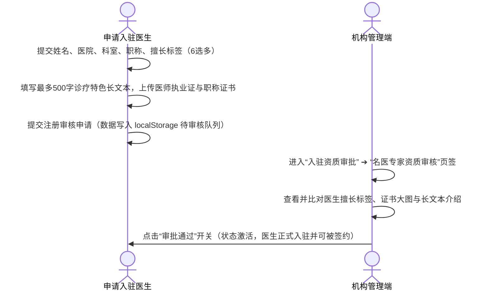
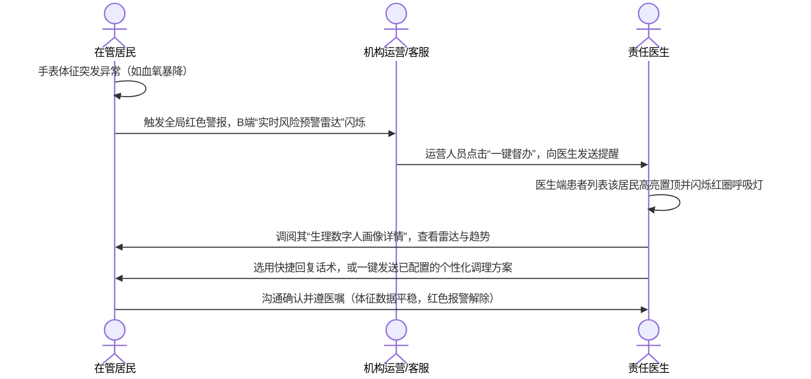

# AI 主动健康管理一体化平台（一期）产品需求文档 (PRD)

## 1. Summary (摘要)
本需求文档（PRD）规范了“AI主动健康管理一体化平台”一期的核心需求。平台通过智能手表实时监测在管居民的心率、血氧、睡眠、血压和步数，并借助中西医结合的 AI 算法生成生理数字人健康画像，供机构管理端和医生工作台调阅。系统旨在打破传统事后医疗的局限，实现事前多体征联动预警、医生在线快捷干预与个性化理疗方案的闭关管理。

---

## 2. Contacts (干干人联系人定义)
| 姓名 | 角色/职责 | 关注点与需求备注 |
| :--- | :--- | :--- |
| **李主任** | 主治医生 (D端代表) | 关注在管患者的体征波动态势，要求方案定制灵活、支持一键套用模板 and IM 快捷话术发送。 |
| **张总监** | 机构运营主管 (B端代表) | 关注名医资质审批、服务包及商品超卖控制、Banner CMS 投放、医患日志审计与医生绩效绩效表。 |
| **王小明** | 在管居民 (C端代表) | 关注佩戴手表后生理指标的异常提醒，并希望能在手机上直接接收并阅读医生下发的个性化理疗方案。 |
| **赵工** | 系统研发负责人 | 主导系统的自适应高宽屏幕适配、SVG 数据动态重绘、防御性空值校验（Defensive null checks）与内存泄漏控制。 |

---

## 3. Background (行业与业务背景)
* **痛点现状**：目前的日常体征监测与专业医疗干预存在脱节。大部分智能手表仅提供孤立的数据展示，缺乏医生端的实时联动；而传统的医院就诊为被动事后治疗，无法实现亚健康阶段的主动维护。
* **技术契机**：多模态穿戴式设备（智能手表）的普及使不间断体征采集成为可能。结合中医脏腑辨证算法与现代西医指标预测，能够实现对人体客观体征的数字孪生模拟。
* **解决方案**：本系统旨在建立一个以“多模态体征 ➔ 实时主动预警 ➔ 机构派单督办 ➔ 医生方案干预”为主线的一体化闭环。这在过去由于数据孤岛及沟通壁垒是无法想象的。

---

## 4. Objective (目标与 OKR 制定)
* **核心目标**：打通智能手表体征监测与中西医主动健康干预服务的业务闭环，建立平滑稳定的浅色数字孪生大屏详情看板。
* **SMART OKRs**：
  - **Objective 1**：建立高效的异常生理指标预警及医生干预响应闭环。
    - *KR 1.1*：医生工作台对红色“风险状态”警报居民的首次 IM 督办回复时间降至平均 15 分钟以内。
    - *KR 1.2*：医生在管居民的“个性化干预方案”一键套用与下发覆盖率达到 85% 以上。
  - **Objective 2**：打造极致流畅、零崩溃的数字孪生画像体验。
    - *KR 2.1*：双端调阅居民健康画像详情弹窗的加载响应时间低于 1.5 秒。
    - *KR 2.2*：系统在 5s 体征定时扰动更新及弹窗多次开闭切换中，控制台抛出的 JavaScript 错误为 0（零红字目标）。
  - **Objective 3**：保证机构端的销售运营联动与合规性。
    - *KR 3.1*：收费服务包与关联商品的超卖拦截判定准确率达到 100%。

---

## 5. Market Segment(s) (市场与用户细分)
市场并非由人口属性划分，而是由用户在特定场景下面临的“任务与痛点（Jobs to be done）”决定：
* **在管居民**
  - *任务*：需要对自己的身体体征（心率、血氧、血压等）进行持续监控，并在出现异常时获得专业中医调理建议。
  - *痛苦*：工作繁重，无暇去医院；指标异常时不知所措，缺乏调理抓手。
  - *获得*：无感监测、明确的三级健康状态通知、直白易懂的中医食疗与起居方案。
* **入驻名医专家**
  - *任务*：跟踪名下签约和咨询居民的体征走势，针对异常进行主动干预。
  - *痛苦*：随访工作量大且零散；手动起草健康方案极为耗时；患者指标异常时缺乏警报推送。
  - *获得*：常态在管列表、一键套用中医模板、快捷话术与方案卡片一键发送。
* **机构运营与客服**
  - *任务*：维护日常基础配置（医生审核、服务包与商品超卖控制、Banner CMS 投放），并在发生重症红色警报时进行人工一键督办派单。
  - *痛苦*：商品库存与服务包配置分离，易超卖；医患沟通明细难以归档和绩效考核。
  - *获得*：全表格化 CRUD 与筛选、红字高亮预警雷达、自动生成的绩效分析表。

---

## 6. Value Proposition(s) (核心价值主张)
* **中西医结合数字孪生大屏**：不同于常规的纯数据报表，系统将手表采集的西医 5 大体征与中医八维脏腑状况（心肺脾胃肾等）、脉象与病机解读深度结合，并以高雅的浅色科技医学风格呈呈现给管理者和医生面前。
* **闭环派单与红色强督办**：当手表检测到指标突降（如血氧暴降）触发红色风险警报时，系统不仅高亮置顶警报，还允许机构人员一键向责任医生发出“督办通知”，打通响应时效。
* **Value Curve (价值曲线对比)**：
  - *常规运动手环*：监测指标多，但无专业医生指导，缺乏主动干预手段（本平台在干预和响应上大幅超越）。
  - *传统线下就医*：干预极专业，但时间成本极高，属于被动事后医疗（本平台在低成本、无感常态监测和时效上完胜）。
  - *本一体化平台*：中西医结合、多体征联动、低门槛、强预警、闭环方案下发。

---

## 7. Solution (系统解决方案)

### 7.1 业务流程与交互规范

#### 7.1.1 医生注册申请与机构审核流程


#### 7.1.2 医患联动 IM 沟通及警报解除流程


---

### 7.2 全局设计与基础规范
1. **健康状态三级统合**：全系统所有角色端（包括大屏、列表、会话框）对用户健康状况的界定统一精炼为**“健康/正常”**、**“亚健康”**、**“风险”**三类。彻底废除“高风险”、“中风险”等冗余词汇。
2. **擅长调理标签限定**：医生的擅长科目与资质多选框必须且仅能从以下六项中进行选择：`失眠多梦`、`经方调理`、`体质调理`、`亚健康调理`、`慢病管理`、`脾胃调理`。
3. **客服角色精简**：废除“系统运营助理”审核流，全系统属于运营管理的辅助角色仅保留**“健康客服”**。在后台配置新客服后，状态为 `已激活` 且直接启用，支持随时切换启用/禁用开关或物理删除。

---

### 7.3 机构管理端 (B端) 功能需求

#### 7.3.1 资质入驻审批
* **多页签分离**：资质审批板块划分为“名医专家资质审核”和“运营客服入驻审核”二级页签。
  - *名医审核*：提供医生姓名模糊搜索、科室筛选，支持查看证书大图及长文本诊疗特色，点击启用/禁用状态开关。
  - *客服管理*：提供客服姓名/手机号检索，管理员可直接添加新客服（填写姓名、手机、初始密码），添加即激活，无需审批。

#### 7.3.2 收费服务包与调理商品配置
* **配置表单与缩略图**：配置服务包或商品时，表单支持输入图片 URL，用于在列表和购买卡片中渲染高保真缩略图。
* **商品分类扩充**：调理商品管理（界面文案统一为“商品管理”）支持**“调理商品”**、**“智能硬件设备”**（如智能手表）以及**“硬件周边配件”**（如充电底座）三大分类。
* **高阶筛选与超卖控制**：
  - *调理商品*：支持商品名称检索、品类下拉筛选、以及库存状态（充足/库存紧张/已售罄，根据物理库存数与预警阈值判定）的多条件联动过滤。
  - *收费服务包*：支持包名检索与销售状态（销售中/已下架/关联商品售罄暂不可售）的联动过滤。如果服务包关联的实物商品库存为 0，则自动将其销售状态拦截判定为 `关联售罄暂不可售`，防止前端超卖。
* **CRUD 与状态解耦**：服务的上/下架、商品的销售/停售、医生的启用/禁用等状态切换由独立的**开关组件（Toggle Switch）**控制；编辑与删除作为操作列独立图标，点击仅触发 Modal 回写与 Confirm 确认，与生效开关彻底解耦。

#### 7.3.3 运营内容管理 (CMS)
* **Banner 生效规则**：Banner 配置包含名称、图片 URL、跳转链接（支持外部 URL 或系统医生/调理包ID）、生效时间段与排序值（1-10级）。Banner 仅在启用状态且系统当前时间处于生效时间段内时才向 C 端展现，多 Banner 按排序值从小到大轮播。
* **名医推荐降序重排**：设置医生的“推荐排序权重分”（1-100分）。C 端展示时，严格按照权重分值从大到小降序排列；若分数相同，则按入驻审批通过的时间戳正序排列（先入驻的靠前展示）。

#### 7.3.4 全局用户档案与绩效日志
* **档案 CRUD 物理闭环**：支持对在管居民的中西医基本信息、初始手表体征数据进行录入、编辑及物理删除。
* **沟通日志明细表**：支持查看会话日期、医生与居民姓名、消息总量、异常触发时间、医生首次回复时间，并提供沟通文本记录导出功能。
* **运营绩效分析表**：统计医生名下在管人次、方案下发总数、红色预警平均响应时间（分钟）、患者服务评价均分，支持按响应时间升序或评价分降序排列。

---

### 7.4 医生工作台 (D端) 功能需求

#### 7.4.1 个人执业形象配置
支持姓名、头像、所属医院科室、执业年限、职称的配置；支持 6 大擅长标签的多选勾选，并提供最多 500 字的长文本诊疗特色长介绍；支持科普图文、视频的“存草稿”、“发布”和“下架”操作。

#### 7.4.2 个性化健康干预方案定制 (列表+弹窗)
* **干预方案列表**：以表格化呈现开具的方案，字段包含：方案名称、接收居民、中医食疗建议、理疗与运动、起居睡眠、开具日期与操作按钮（编辑/删除）。
* **模板套用弹窗**：点击“+ 新定制干预方案”或编辑时弹出 Modal 框，支持医生快速点选套用预设的中医理疗模板。保存时自动读写 localStorage 并归档写入患者个人档案。

#### 7.4.3 智能会话管理
* **物理比例与精简**：聊天视窗去除了原有的右侧手表实时大面板，保持标准的手机比例。
* **快捷话术下拉菜单**：聊天输入框上方配置“💬 快捷回复话术”下拉框，医生点选常用话术后，对应文字自动填入输入框，支持编辑发送。
* **方案气泡一键发送**：配置“📋 发送个性化方案”下拉框，自动提取 `recipesArchive` 中的个性化方案数据。医生点选后，系统自动拼装食疗、运动、作息建议，发送图文理疗卡片气泡给用户。
* **状态精炼与文件发送**：右上角和底部状态栏去除冗余字样，统一为“在线”；聊天输入栏增加“图片（📷）”与“文件（📁）”上传发送功能。

#### 7.4.4 我的用户健康档案调阅
* **档案对齐**：彻底去除冗余且不闭环的“随访登记”与随访监控建档逻辑，变更为“我的用户”健康档案库。表格字段、样式和详情弹窗与机构端完全保持一致。
* **风险红圈呼吸灯**：若名下用户健康状态更新为 `风险`，卡片强制脱离分组并置顶，头像闪烁红圈呼吸灯，提示医生点击“数字人”按钮调阅健康画像。

---

### 7.5 居民健康画像数字孪生大屏详情弹窗（浅色科技版）
该画像看板嵌入在机构端“在管用户档案”详情和医生工作台“我的用户”详情中。弹窗（模态框）容器类名为 `.record-detail-container`，为 3 栏式大屏结构（宽度 95vw, 高度 92vh 适配，禁止全局滚动），背景为高雅的浅色科技医学风格：

```
+----------------------------------------------------------------------------------------------------------+
|  A-1 居民健康画像数字孪生看板                                                  [手表指标 5s 动态刷新]    [✕]  |
+----------------------------------------------------------------------------------------------------------+
|  [左列：基础+体征+趋势]               |  [中列：生理数字人中心区]                 |  [右列：睡眠+运动+中医雷达]          |
|  +---------------------------------+  |  +---------------------------------+  |  +---------------------------------+ |
|  | B-1 用户核心资料                |  |  |                                 |  |  | G-1 睡眠三色堆叠柱状图及占比     | |
|  | 用户名 / 手机 / BMI高亮评级      |  |  |       C-1 3D 生理数字人模型     |  |  +---------------------------------+ |
|  +---------------------------------+  |  |   (浅蓝渐变背景、亮蓝色骨骼器官) |  |  | H-1 运动强度24h直方图           | |
|  | D-1 5大实时体征数据卡片         |  |  |                                 |  |  +---------------------------------+ |
|  | 心率 -> 睡眠 -> 血压 -> 血氧 ->步数|  |  |   C-2 双层顺/逆时针刻度底座旋转 |  |  | I-1 八维脏腑气血雷达图           | |
|  +---------------------------------+  |  |   C-3 24h评估状态及星级打分     |  |  |     (小肠虚热收缩多边形)         | |
|  | E-1 30天历史趋势 SVG 折线图      |  |  |                                 |  |  | I-2 中医脉象病机与症状解读       | |
|  | (5 个体征 Tab 平滑切换重绘)       |  |  |                                 |  |  |                                 | |
|  +---------------------------------+  |  +---------------------------------+  |  +---------------------------------+ |
+----------------------------------------------------------------------------------------------------------+
```

#### 7.5.1 模块 A：顶层标题栏 (Top Header)
* **A-1**：醒目显示“居民健康画像数字孪生看板”，右侧绿字标注 “手表指标 5s 动态刷新” 状态，右上角提供“✕”关闭按钮。

#### 7.5.2 模块 B：用户核心信息 (User Profiles)
* **B-1**：显示脱敏的“用户名”、“手机号”、“性别年龄”、“身高体重”和“BMI”。BMI 框自动根据数值区间打上绿色（正常）、黄色（超重）、红色（肥胖）等评级标签。

#### 7.5.3 模块 C：生理数字人中心展示区 (Physiological Digital Twin Model)
* **C-1 3D数字人模型**：中心区背景为浅蓝色径向渐变，站立半透明蓝色未来派 3D 人体模型，展示内部核心骨骼线框和发光器官（大脑、跳动的心脏、肺、胃和肾），心脏伴随规律搏动缩放动画。
* **C-2 底座旋转动效**：底座为亮蓝色双层透视环，具有顺时针与逆时针的反向科技刻度自旋动画。
* **C-3 浮动标签气泡**：模型两侧悬浮白色透明椭圆体征气泡（包含图标和异常文本提示），伴随轻微的上下漂浮动画，且有科技感虚线引线指向人体相应靶区。
* **C-4 总体评估**：数字人底座下方展示“24小时健康评估”等级（健康/亚健康/风险）及星级打分（如“★★★★☆ 正常”）。

#### 7.5.4 模块 D：实时生理体征数据 (Real-time Vitals)
位于左侧中部，包含 ❤️心率波动、🛌睡眠总时长、🩺血压变动、🩸血氧饱和、🏃今日步数 五个卡片，展示实时数值、异常评级和“刚刚”更新时间戳。

#### 7.5.5 模块 E：用户生理数据趋势 (Physiological Trends)
位于左下侧，包含心率、血氧、睡眠、血压、步数 5 个 Tab。点击 Tab 平滑切换重绘 SVG 30天折线走势图。折线下方填充半透明蓝色渐变层，背景网格线为淡灰色。

#### 7.5.6 模块 F：未来疾病风险概率 (Disease Risk)
位于中下列，条形直方图展示脑血管、房颤、心力衰竭、冠心病、心梗等预测患病概率（0% - 100%），进度条根据风险值高低自动应用绿、黄、红三色。

#### 7.5.7 模块 G：睡眠分析 (Sleep Analysis)
位于右上侧，总睡眠时长大字显示。三色（清醒黄、浅睡冰蓝、深睡深蓝）堆叠柱状图展示一整晚睡眠周期分段；右侧垂直展示各阶段占比条与百分比。

#### 7.5.8 模块 H：运动分析 (Motion Analysis)
位于右中侧，24根条形直方柱展示一天 24 小时的运动强度走势，上方大字标注“当日累计运动量”步数。

#### 7.5.9 模块 I：器官分析与中医脉象诊断 (TCM Diagnosis)
位于右下侧，结合中医脏腑气血状态：
* **I-1 八维雷达图**：精确 SVG 计算生成八维多边形，顶点为：心、胃、肺、大肠、肾、脾、肝、小肠。若患者为亚健康/风险状态，器官顶点内缩（如小肠气血亚健康大幅内缩），多边形自适应变形。
* **I-2 辨证诊断**：中央显示“小肠 亚健康”或“脏腑健康”，右侧列出常见症状（如“胸胀、易便秘”），右下显示脉象解读（如“心肾不交，小肠虚热，阴阳不调”）。

---

### 7.6 机构数据一览大屏 (Index) 产品需求与下钻设计 (一屏流布局)

#### 7.6.1 视觉布局与一屏流规范
* **一屏流布局 (No Scroll)**：数据大屏在前端展示时，必须采用自适应的弹性布局（CSS Flexbox/Grid），严格设置 `height: 100vh; overflow: hidden;`，完全去除垂直与水平滚动条，使页面元素在各种显示器下均可优雅填充。
* **信息聚焦与提取**：剔除大屏主界面过于繁杂的单个生理 ECG 实时波形 Canvas，仅提取全局汇总与警情趋势宏观数据，使运营与管理层在大屏上第一眼即可看清最核心的健康态势。
* **点击更多下钻设计模式**：各大屏模块右上角均提供“更多”或“明细”小按钮，点击后通过 **全屏磨砂模态窗口 (Fullscreen Light-themed Overlay)** 优雅滑出（尺寸设计为统一的 `width: 92vw; height: 88vh;`），背景伴随 `backdrop-filter: blur(12px)` 遮罩模糊。**为了对比大屏暗色本身，下钻列表窗口内部统一采用高雅清晰的浅色偏医学科技风格**，以深色字体和浅色隔栅展示细致的微观数据。

#### 7.6.2 数据大屏核心数据要素
1. **机构医生数**：以发光 neon 字体展示当前机构入驻并激活执业的医生总量。**附加丰富展示**：细分展示高级职称与中初级职称的医生人数分布及对比进度条。
2. **管理用户数**：展示机构当前管理的居民建档总量，小字显示本月新增签约人数。**附加丰富展示**：统计在管居民男女占比比例和在管平均年龄。
3. **实时生命体征流水**：**新增要素卡片**。大屏左下角提供 `实时智能体征回传流水` 容器，以每 4 秒独立向上刷新滚动的形式，呈现手表最新的实时数据回传和突发高危报警预警。
4. **每日健康状态汇总**：以三色发光环形图（Donut Chart）直观展示全平台在管用户的健康等级分布（🟢 正常/健康 | 🟡 亚健康 | 🔴 风险），Donut 带有渐变底轨与呼吸阴影效果。
5. **每日脑血管预警人数**：居中突出呈现今日突发血管疾病预警的累计人数（配以发光红色呼吸灯），并配有近 7 日每日预警触发频度的高清圆角渐变趋势柱状图。
6. **商品套餐销售情况**：按销量大小排序列表展示畅销的 Top 5 收费服务包及调理实物商品，支持超卖警示。
7. **设备连接数**：霓虹环形进度条配合百分比大字，展示当前在线的手表连接数与总发放手表的比例，并标记低电量预警数。
8. **大屏头部系统汇总**：**新增要素**。在大屏顶端新增“全网心率均值”和“日均步数均值”动态体征统计，全面填充大屏头部留白。

#### 7.6.3 5 大核心模块“点击更多”下钻明细列表页规格

##### 1. 机构医生执业健康管理下钻明细
* **弹窗 ID**：`#drilldown-doctors-modal`
* **成熟交互模式**：双栏联动分析结构 (Split-Panel Analytical View)。
  - *左侧汇总栏*：大字指标展示本月接诊之星医生、科室医生占比饼图、以及签约服务平均饱和度仪表盘。
  - *右侧明细栏*：顶端配置姓名检索输入框与所属科室下拉筛选框。明细大表字段包含：医生姓名、所属科室、职称、签约饱和度（如 `82/100`）、今日已处理警报数、累积干预下发数、执业状态开关。
  - *行操作*：点击行内操作的 `[执业名片]`，可弹出浮空卡片查看该医生 500 字擅长特色介绍及科普文章。

##### 2. 在管居民健康监控下钻明细
* **弹窗 ID**：`#drilldown-users-modal`
* **成熟交互模式**：三色卡片联动筛选列表 (Donut Chart Filter Grid)。
  - *顶部状态卡片*：并行展示 🟢 正常/健康 (XX人) | 🟡 亚健康 (XX人) | 🔴 风险 (XX人) 三色大数字圆角卡片，点击任一卡片可作为快速过滤器，联动刷新下方数据表。
  - *下端数据表*：支持姓名搜索与责任医生联动过滤。大宽表字段包含：居民姓名、脱敏手机号、当前健康评级（正常/亚健康/风险三色标）、绑定手表 IMEI、今日累计步数、最新心率、最新血压、最新血氧饱和度、睡眠时长（昨日）、责任医生、最后一次心跳同步时间。
  - *二级下钻联动*：大宽表的行操作列提供 `[生理数字人详情]` 按钮。点击后，可**直接调起该居民的 3D 生理数字人详情大屏弹窗 (`#record-detail-modal`)**，实现从大屏全局 ➔ 居民列表 ➔ 居民个人生理孪生数字人详情画像的“二级连续下钻”闭环。

##### 3. 每日脑血管与疾病风险预警督办下钻明细
* **弹窗 ID**：`#drilldown-alerts-modal`
* **成熟交互模式**：派单督办工作流面板 (Alert Ticket Workflow Panel)。
  - *左侧统计栏*：展示今日血管风险总出险次数、AI预测房颤/心力衰竭/心梗触发比例图、医生响应预警的平均时效。
  - *右侧工作台*：顶部按预警处理状态（待处理/跟进中/已解除）进行页签筛选。表格字段包含：出险时间、居民姓名、异常体征触发读数（如：`血氧: 91%`）、AI疾病预测值（如：`心脑血管风险 89%`）、责任医生、督办状态。
  - *行操作与工作流逻辑*：
    - `[一键督办]` 按钮：点击后，通过 localStorage 消息队列，向该居民的责任医生工作台发送强交互的工单提示“【督办通知】您的在管居民王小明发生脑血管红色预警，请立即介入并开具方案”，系统将督办状态变更为 `跟进中`。
    - `[解除警报]` 按钮：弹出解除窗口，由运营填写处置原因（如医生已处置、数据恢复正常），保存后状态归档为 `已解除`，大屏预警数和闪烁呼吸灯停止。

##### 4. 调理商品与服务套餐销售分析下钻明细
* **弹窗 ID**：`#drilldown-sales-modal`
* **成熟交互模式**：商业卡片 + 库存预警监控 (Inventory & Revenue View)。
  - *左侧汇总栏*：展示今日总销售额、本月畅销套餐名次、当前处于低库存预警的商品总数。
  - *右侧销售大表*：顶部提供服务包与调理商品 Tab 切换。表格包含字段：套餐/商品名称、商品品类（调理商品/智能硬件/硬件周边）、单价、累计销量、累计销售额、当前库存、库存预警阈值。
  - *超卖控制提醒*：对于当前物理库存为 0 的商品，行内库存单元格高亮显示红字“`已售罄`”，且其关联的服务包在表格状态中联动提醒“`关联售罄暂不可售`”，大屏将实时截断该商品的销售。

##### 5. 多模态设备连接与心跳同步下钻明细
* **弹窗 ID**：`#drilldown-devices-modal`
* **成熟交互模式**：设备网络状态与心跳监测大表。
  - *左侧设备统计*：展示手表总发放数、在线手表占比环形图、以及当前低电量（低于 20%）的报警设备数。
  - *右侧设备列表*：大宽表包含字段：手表 IMEI 号、持有居民姓名、在线状态（在线/离线/异常）、无线信号强度（dBm，分为优秀/一般/微弱）、当前电量（配电池图标展示，低于 20% 显示红字警告）、最后数据同步时间。

---

### 7.7 技术保障与性能规范
1. **防崩溃设计 (Defensive Null Checks)**：由于大屏及数字人画像中包含大量的 SVG 顶点重画、Tab 切换和实时体征更新，在操作 DOM 元素（如 `document.getElementById`）和定时调用刷新时，**必须加严格的 `if` 判空防御**，防止由于弹窗已关闭、页面切换或 DOM 尚未加载完成而导致的 `TypeError` 崩溃。
2. **内存泄漏与定时器管理**：弹窗打开时，自动触发 `detailPerturbationInterval` 模拟智能手表体征的 5s 动态微幅扰动；在点击“✕”或遮罩背景关闭弹窗（触发 `closeRecordDetailModal()`）时，**必须执行 `clearInterval(detailPerturbationInterval)` 彻底注销并销毁定时器**，杜绝后台死循环与内存泄露。
3. **下钻明细性能与定时器清理**：当下钻明细模态框被关闭时，系统必须自动销毁弹窗内局部图表渲染或定时数据回传产生的任何计时器；所有下钻数据更新、分类联动过滤及二级下钻穿透弹窗的 DOM 指针操作，必须严格在 defensive null 检查通过后运行，确保零内存泄漏。
4. **数据一致性机制**：双端详情大屏与下钻大表的数据完全基于全局 `patients` 数组。在管居民档案的新增、编辑和删除动作自动同步至 `localStorage` 的 `patients` 数据源中，确保机构端、医生端和数据大屏数据联动一致。

---

## 8. Release (发布计划)

### MVP (第一阶段 - 当前版本)
* **发布形式**：本地 H5 原型工程（包含 portal, institution, doctor, doctor_connect, doctor_register）。
* **持久化**：数据流转依赖浏览器 `localStorage`（如 recipesArchive, patients 待审批医生队列等）。
* **画像表现**：实现浅色系高雅医学风画像看板，内嵌至双端详情弹窗，完全跑通 5s 数据扰动和 SVG 绘制。

### Phase 2 (第二阶段)
* **后端落地**：将 Python `server.py` 从简单的静态文件代理升级为 RESTful API 接口服务，将 localStorage 数据结构迁移至 SQLite 数据库中。
* **硬件对接**：接入主流智能手表（如华为、小米、Apple Watch）的开放 HealthKit/开放 API 接口，实现后台真人体征数据的自动实时获取和推送。
* **移动端部署**：对医生 IM 对话和用户接收端进行移动浏览器自适应排版深度优化，并打通微信小程序及公众号提醒。
