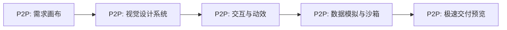

# Antigravity 专属【P2P: 从需求到交互原型】技能卡

你好！在产品设计领域，将**模糊的需求（Requirements）**快速转化为**高颜值的交互式高保真原型（Interactive Prototype）**，是 AI 时代产品经理、业务分析师（BA）和 UX 设计师的核心痛点。

为此，我为你特别定制并适配了这套 **【P2P (Product-to-Prototype) 专属产品设计与原型技能卡】**。

你可以通过在对话中输入对应的指令（如 `[P2P: 需求画布]` 或 `[P2P: 交互与动效]`），来启动不同阶段的结构化解决方案。

---

## 🧭 P2P 工作流与技能卡定义

### 1. 📋 需求画布卡 (Requirements & Persona Canvas)
*   **如何触发**：`[P2P: 需求画布] [您的原始想法/PPT或Word草稿]`
*   **我的承诺**：我将拒绝直接编写代码，而是将您的原始想法转化为：
    1.  **用户画像与使用用例 (Persona & Use Cases)**：明确有几端、主要用户分别是谁。
    2.  **页面布局树与导航流 (Site Map & Navigation)**：页面由几个面板/版块构成，用户如何在其间跳转。
    3.  **核心业务状态机**：整理交互中的核心状态变化（例如：正常状态 $\rightarrow$ 检测中状态 $\rightarrow$ 异常警报状态）。
*   **产出**：生成一份结构化原型方案。

### 2. 🎨 视觉设计系统卡 (UI Design System)
*   **如何触发**：`[P2P: 设计系统] [确定配色与设计风格]`
*   **我的承诺**：我将为您构建原型的 CSS 视觉体系，确定：
    1.  **专属色彩变量**：严禁使用高饱和度纯色。采用符合主题的渐变色系（如：健康科技 Teal `#0f766e`、暗色科技 `#08090d` 等）。
    2.  **界面美学风格**：确定采用毛玻璃拟态（Glassmorphism）、微浮雕（Neumorphism）或现代极简主义。
    3.  **无占位符资产（No-Placeholder Rule）**：使用 `generate_image` 为产品、头像、分析图生成高精度的真实商业配图，拒绝使用任何灰色占位方块。
*   **产出**：编写高保真的全局 `style.css`。

### 3. ⚡ 交互与动效引擎卡 (Interactive & Micro-animation)
*   **如何触发**：`[P2P: 交互与动效] [您希望增加的动态反馈]`
*   **我的承诺**：我将使用纯 CSS 过渡与原生 JS 配合，实现让原型“活起来”的微动效：
    1.  **状态转换过渡**：如弹窗出现时的 3D 偏转与震荡、卡片悬浮时的发光和位移。
    2.  **特色科技特效**：如激光扫描线的平移、呼吸灯闪烁警报。
    3.  **高性能绘图**：利用 HTML5 Canvas 绘制动态心电波、雷达图、趋势折线图，摆脱繁重的第三方图表库依赖。
*   **产出**：编写负责交互与 Canvas 的 `app.js`。

### 4. 📊 动态数据模拟卡 (Mock Data & Sandbox)
*   **如何触发**：`[P2P: 数据模拟] [输入字段与波动策略]`
*   **我的承诺**：我将为原型注入“动态血液”：
    1.  **时序波动发生器**：利用定时器模拟心率、体脂等数据的实时跳动。
    2.  **智能场景模拟器**：支持点击演练按钮，一键由正常体征演变为危急值，并触发全屏警报。
    3.  **AI 大模型对话沙箱**：集成简易的知识库和打字机效果，使用户可以直接与原型中的“AI助手”进行对话测试。
*   **产出**：在 `app.js` 中集成完整的场景控制逻辑。

### 5. 🚀 极速交付与本地预览卡 (Local Preview & Review)
*   **如何触发**：`[P2P: 预览交付]`
*   **我的承诺**：我将整合所有静态文件，通过 Python 在本地工作区一键拉起轻量级本地 Web 服务器，自动生成预览链接。
*   **产出**：提供局域网/本地调试地址，方便您在手机或平板上直接查看并体验原型。
