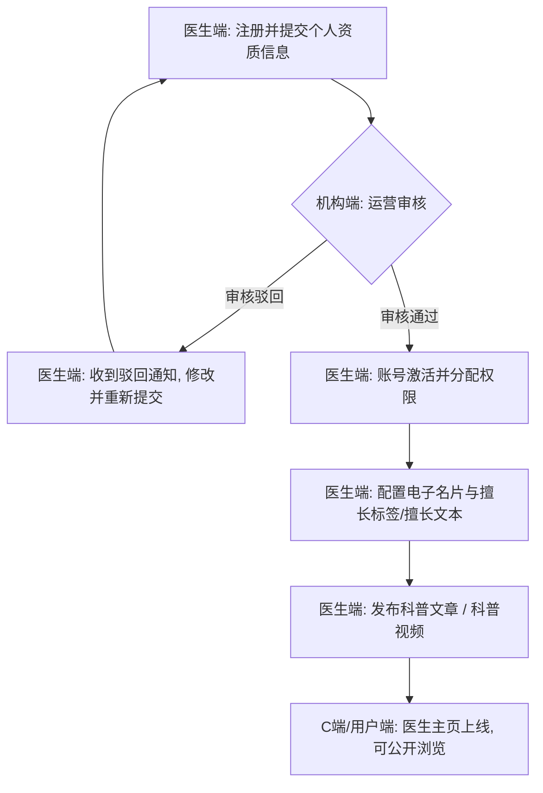
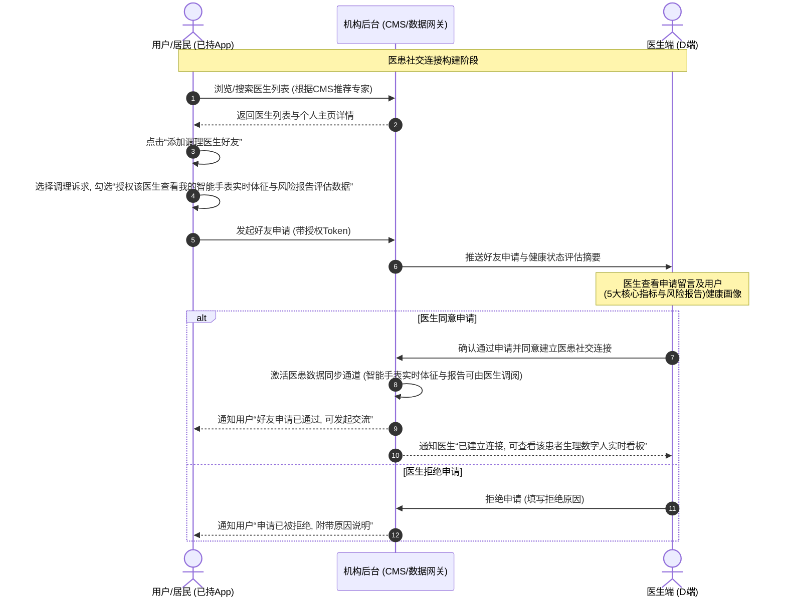
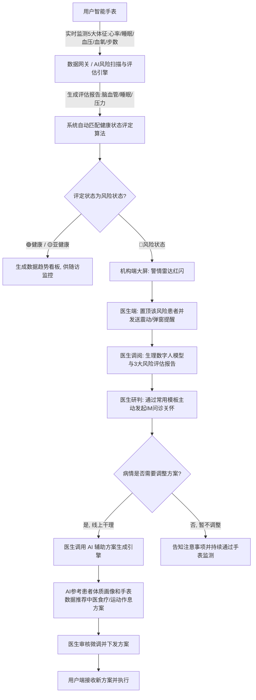

# AI主动健康管理一体化平台 - 功能框架与业务流程细化方案

## 一、 产品定位与分工

### 1.1 产品定位
**“连接智能手表、用户、医生与医疗机构的中西医结合主动健康管理平台”**
- **主动干预**：打破传统“患者生病找医生”的被动诊疗模式。通过智能手表对居民体征（心率、睡眠时长、血压、血氧、步数）进行实时采集，利用AI算法进行不间断风险扫描。一旦发现指标异常、生成风险报告或健康恶化趋势，系统主动向对应医生触发报警，由医生主动对居民发起线上关怀与干预方案，实现“预警-干预”的主动闭环。
- **中西医结合**：在健康画像与干预处方上深度融合中西医理论。根据手表的异常体征数据和健康状态评估，AI算法辅助医生一键生成包含中医食疗、经络调理、运动和作息调理的个性化干预方案。

### 1.2 双端定位分工
- **机构端 (B端/运营管理后台)**：平台运营的主体，负责医生资质审批、客服账号直接添加、服务商品化配置（含服务包图片、智能硬件及周边配件商品）、CMS内容配置。通过全局健康档案库和实时警情大屏监控整体运营，提供业务明细与绩效报表。
- **医生端 (D端/医用系统)**：医生接诊、健康档案调阅和干预的工具。医生在此配置执业主页，查看在管用户健康档案与智能手表体征，利用“列表+弹窗表单”为患者定制/编辑方案，并在对话中一键发送方案和快捷回复。
*(注：根据用户反馈，本次方案不规划用户端（C端）的功能框架，而专注于机构端与医生端的系统建设。)*

---

## 二、 机构端功能框架细化 (B端)

机构端是主动健康管理平台的中枢，主要负责保障资质、配置产品、管理档案库以及数据大屏监控。

```
机构管理端 (B端)
├── 医生资质审批与客服直接添加 (医生提报审核/客服账号后台直接创建)
├── 服务产品化配置 (收费服务包配置/商品管理含智能硬件与周边/配置展示图片)
├── 运营内容管理 (CMS) (简易图片Banner配置/推荐专家配置与排序)
├── 全局用户健康档案库 (生理数字人看板/智能手表5大指标/报告集成/脏腑辨证/对比曲线)
└── 机构数据一览 (实时警情大屏/医患沟通明细/运营绩效报表)
```

### 2.1 医生及客服入驻审批系统
- **资质提报与审核**：支持医生提交个人身份证件、执业资格证、职称证、执业范围、所属医疗机构与科室。机构运营人员在后台审批医生资质，在管医生与健康客服分开展示与管理。
- **角色与权限分配**：审核通过的医生自动激活账号，分配“调理医生”角色。健康客服无需入驻申请，在后台一键创建添加后即可直接激活。
- **全局列表基本操作**：全列表加入增删改查基本操作，并将开启/关闭开关与增删改查编辑模态框分离，增加必要的列表筛选条件。

### 2.2 主动健康服务产品化配置
- **收费服务包配置**：采用成熟表格布局，一行一个服务包。支持配置服务包的名称、展示图片、价格、服务周期（如30天、90天）、服务次数上限、关联的商品。支持启用、禁用与编辑修改。
- **商品管理**：建立主动健康商品库（包括药膳包、滋补膏方、养生茶等调理商品，以及智能手表等智能硬件设备、充电底座等硬件周边配件）。采用成熟表格布局，支持配置商品名、展示图片、类别选择、价格、库存及预警。
- **关联方案策略**：配置商品在医生干预方案中的调用规则，医生在下发方案时，可一键关联并推荐这些产品。

### 2.3 运营内容管理 (CMS)
- **首屏Banner配置（简易图片配置）**：仅支持基本的图片广告位配置。包含上传Banner图（支持JPG/PNG）、配置C端跳转链接（可跳转至特定名医主页、调理包详情页或科普文章）、设定播放顺序、设置上线/下线时间。
- **推荐专家配置**：支持从已入驻审核通过的医生名录中挑选“推荐专家”，并配置其排序权重值或通过拖拽更改展示顺序，决定在用户端首页/列表页的曝光率。

### 2.4 全局用户健康档案库（生理数字人画像看板）
平台支持生成高可用的**健康画像看板**。该看板不再作为独立的 Demo 页面展示，而是全面嵌入在机构管理端（B端）用户档案详情与医生工作台（D端）我的用户详情弹窗中。看板界面重塑为高雅的浅色科技医学风格，系统结合智能手表的 5 大指标与中医辨证分析，生成“生理数字人模型”看板，具体功能设计如下：

- **基本档案信息区**：展示用户基本资料，包括用户名（脱敏展示）、手机号（脱敏）、性别年龄、身高体重、BMI 指数（自适应高亮健康等级）。
- **智能手表 5 大健康指标区**：展示智能手表回传的当前最新生理参数，并支持手表指标 5s 动态微幅扰动模拟：
  1. **心率**：展示实时心率（次/分）、心率状态（偏快/偏慢/正常）、数据更新时间。
  2. **血氧**：展示血氧饱和度百分比（%）、血氧状态（正常/偏低）、数据更新时间。
  3. **睡眠时长**：显示今日睡眠总时长，状态（充足/不足），以及最后测量更新时间。
  4. **血压**：展示收缩压与舒张压（mmHg）、血压状况（正常/偏高/偏低）、数据更新时间。
  5. **今日步数**：显示今日累计总步数，运动状态（达标/不足）。
- **生理数字人核心展示区**：
  - 居中渲染半透明蓝色数字人体模型。
  - 人体模型周围挂载浮动的白色背景悬浮气泡，通过纤细引线连接人体靶区，动态展示体征参数。
  - 模型下方有旋转的双层科技刻度旋转底座，提供微弱投影。
- **24小时健康状态综合评估**：
  - 展示算法评定出的健康状态定级（健康、亚健康、风险状态，取消中/高风险，统一为风险状态）。
  - 辅以星级直观展示，如“亚健康 ★★★★☆”。
- **疾病风险预测看板（结合三大风险报告评估算法）**：
  - 基于血压波动及心率变异性，预测未来一个月脑血管疾病风险概率（包括房颤、心力衰竭、冠心病、心动过速、心动过缓、心肌梗死风险概率条形图）。
- **中医脏腑辨证分析区**：
  - 呈现本经脏腑气血状态（如“小肠 亚健康”）。
  - 展开中医辨证详情：包含虚证/实证判别（如脾虚湿盛）、表现症状、脉象与病机合理解释，并显示影响受累脏腑。
- **用户生理数据趋势看板**：
  - 提供心率、血氧、睡眠、血压、步数等 Tab，切换时平滑重绘对应的 30 天历史波动折线图，折线下方填充淡蓝色渐变。
- **深度睡眠监测与质量分析**：
  - 顶部显示总睡眠时长、深睡时值、浅睡时值，以三色（清醒黄、浅睡冰蓝、深睡深蓝）堆叠柱状图展示睡眠分段；侧边栏显示深睡、浅睡、清醒的百分比例条。
- **运动强度与日常活动监控**：
  - 展示当日累计运动量以及一日内运动强度的 24 根直方图柱子。
- **器官气血状态与中医脉象诊断**：
  - 核心是一个八维器官健康雷达多边形（顶点代表心、胃、肺、大肠、肾、脾、肝、小肠），多边形根据气血分数动态计算并渲染缩放。
- **防内存泄漏定时器销毁交互**：
  - 弹窗关闭时，必须彻底清空并销毁 5s 手表体征数据扰动定时器，防止 TypeError 崩溃。

### 2.5 机构数据一览与明细报表
- **实时数据监控大屏（数据大屏）**：
  - *核心指标看板*：展示机构医生总量（分职称统计）、建档居民总量（分性别年龄统计）、手表设备连接率、今日累计脑血管预警人数、今日调理销售额，并在大屏顶端实时汇总“全网心率均值”与“日均步数均值”。
  - *实时体征回传流水*：**（新模块）** 左下角配备动态体征回传日志流水，每 4 秒接收并平滑滚动回传最新手表体征（心率、血压、步数、电量等），且能对高危异常信号高亮为红色出险预警，保证时效性。
  - *高级霓虹图表*：大屏主页包含 Donut 健康状态图、近 7 日脑血管圆角直方图、带发光指示粒子的设备连接率 Gauge 图，均配以高保真暗色霓虹渐变和发光微阴影。
  - *高雅浅色下钻*：各大屏模块支持点击更多进行明细下钻。**下钻出的 5 大明细窗口（医生执业、居民监控、督办工作流、销售排行、设备网络）统一采用高雅清晰的浅色偏医学科技风格**，以深色字与亮白底格栅形成精美的大屏视觉反差，并支持向居民 3D 数字人画像看板的二级下钻。
- **业务明细报表**：
  - *医患沟通明细*：机构有权检索和抽查任意医患之间的聊天记录（文字、图片、语音转文字记录），用于合规监控及服务质量抽检。
  - *运营绩效报表*：统计各医生的接诊量、干预方案生成量、报警响应时间、患者满意度评分。

---

## 三、 医生端功能框架细化 (D端)

医生端是临床干预与日常沟通的控制台，重点在于个人品牌的展示、名下管理用户健康档案的调阅以及干预方案的定制下发。

### 3.1 执业个人主页配置
- **执业电子名片**：包含医生姓名、头像、职称、执业年限、所属科室及机构。
- **擅长标签管理**：提供结构化擅长标签勾选/设置（包含：失眠多梦、经方调理、体质调理、亚健康调理、慢病管理、脾胃调理），方便在C端进行医生精准检索和筛选。
- **擅长文本管理**：**（新增功能）** 允许医生编辑保存一段自由撰写的详细擅长文本（支持字数在500字内，可阐述具体的调理学术流派、特色临床案例及个人诊疗心得）。该文本作为长介绍，用于弥补单调“擅长标签”对医生多维度能力的局限，提升医患信任度。
- **科普文章发布**：支持富文本编辑器，允许医生撰写并发布中西医科普图文。
- **科普视频发布**：支持上传短视频（支持MP4/MOV格式，限制大小在100MB内），系统自动压缩转码并在其主页科普视频列表中进行展示。

### 3.2 个性化健康干预方案定制（列表+弹窗表单）
- **干预方案列表与CRUD**：页面以成熟表格形式展示医生已开具的干预方案（包含方案名称、接收居民、食疗、运动、起居、日期等），支持查询与方案的编辑修改及删除。
- **定制干预方案弹窗**：点击“+ 新定制干预方案”或“编辑”可唤起模态弹窗表单。表单包含：在管居民下拉选择（编辑时禁用）、方案名称、食疗、运动、起居睡眠、医生医嘱及推荐关联商品勾选。
- **方案模版一键套用**：弹窗右侧挂载“常用中医健康方案模板”侧栏，点击可一键套用对应模版的食疗、运动与作息内容并匹配关联商品，医生可在其基础上修改保存。

### 3.3 智能会话管理与双端沟通
- **双端IM通信**：支持与患者收发文字消息。
- **快捷回复与方案发送**：对话界面集成“快捷回复”下拉选择框和“发送个性化方案”下拉选择框。医生可快速选择高频话术一键填入输入框，或选择已配置的干预方案一键直接发送给用户。
- **移除手表实时看板**：根据用户规则，聊天区域已精简，不再挂载和显示智能手表实时看板，确保界面聚焦于纯粹高效的沟通交流。

### 3.4 我的用户与健康档案调阅
- **“我的随访监控”模块重塑**：彻底去掉原“我的随访监控”模块及相关的随访登记和报警事件交互，重塑为“我的用户”，重点用于“调阅管理用户的健康档案”。
- **用户列表与风险置顶**：展示我管理的用户列表，按签约、咨询分类。健康状态为“风险”（红）的用户强制置顶，并带有动态呼吸灯报警。
- **选中用户健康档案调阅**：点击用户后，右侧栏动态渲染该用户的健康档案看板（包括手机号、BMI、中医体质、签约在管状态等基本画像，以及智能手表的心率、血氧、血压、睡眠、步数5大实时指标数据表格）。
- **折线趋势与方案归档**：下方联动渲染近30天/近90天心率、血氧、血压波动对比折线图（SVG绘制），并可检索其历史开具的健康干预方案归档记录。

---

## 四、 核心业务流程重构 (Key Workflows)

结合用户提出的核心业务流程（图2）及修改意见，我们将核心流程细化为以下三个子流程。

> [!IMPORTANT]
> **线下转诊系统边界说明**：
> 根据最新业务规划，线下就医与转诊属于完全**线下执行**的业务流程。因此，平台系统**不设计**线上转诊单流转、线上预约挂号、绿色通道凭证生成、机构转诊审批或扫码就诊核销等系统功能。
> 医生在线上沟通中若研判患者指标或风险评估持续偏高，直接通过智能会话（调用预设话术）向居民提出线下就诊建议，引导居民自主前往线下医院检查治疗。

### 4.1 流程一：医生入驻、资质审核与主页发布流程
展示医生从提交资质到名片在用户端上线的完整闭环。



### 4.2 流程二：医患社交连接与数据授权流程
用户在APP上浏览医生并申请加好友，同时**授权智能手表监测指标与风险报告查看权限**的流程。



### 4.3 流程三：智能手表主动预警与医患在线干预闭环流程
展示当智能手表检测到用户核心指标异常或评估出高危风险报告后，系统如何主动触发预警，医生如何利用AI辅助生成干预方案。



---

## 五、 居民健康画像看板详情弹窗功能框架与视觉设计说明

为了向机构管理人员、医生以及受检居民提供极具震撼力的主动健康孪生画像展示，平台一期将“居民健康画像”看板彻底融入到 B端/D端的居民健康档案详情弹窗中。以下是该看板的核心框架设计与视觉技术实现说明。

### 5.1 功能框架结构
看板以脱敏后的居民健康档案及实时手表体征数据为核心，将前台展示模块划分为如下结构：
1. **顶层标题栏 (Top Header)**：弹窗顶部醒目显示“居民健康画像数字孪生看板”，右侧显示“手表指标 5s 动态刷新”的运行状态。
2. **用户基本资料 (User Profiles)**：展示受检人脱敏后的姓名、电话、性别年龄、身高体重以及自动计算的 BMI（集成状态判断）。
3. **生理数字人中心区 (Physiological Digital Twin)**：
   - **半透明蓝色数字人**：展示内部的大脑、肺部、胃部、肾脏等解剖脏腑及骨骼框架。
   - **白色悬浮气泡**：血压、睡眠、血氧、步数、BMI、心率 6 个悬浮椭圆卡片指向具体脏腑或肢体。
   - **自旋发光底座**：双层旋转科技刻度环提供空间透视感。
   - **总体健康星评**：直接显示“24小时健康评估”及其状态（如：亚健康）与星级评定。
4. **实时手表数据 (Real-time Vitals)**：左侧卡片展示，每 5 秒自动产生数据扰动并刷新，包含心率（次/分）、血氧（%）、睡眠（小时）、血压（mmHg）、步数（步）。
5. **生理数据趋势图 (Physiological Trends)**：左下侧历史图，通过 Tab 标签进行数据源的切换，折线及 Y 轴刻度动态平滑重绘。
6. **疾病风险预测 (Disease Risk Probability)**：中下侧风险看板，以水平进度条形式展示房颤、心衰、冠心病、心率失常及心梗等疾病的预测患病风险。
7. **睡眠与运动监控 (Sleep & Motion Analysis)**：右侧数据看板，展示睡眠时长结构堆叠图（清醒/浅睡/深睡三色分段）及 24 小时步数强度分布直方图。
8. **中医脏腑辨证与脉象诊断 (TCM Diagnosis)**：右下侧诊断看板，核心为 8 维器官健康雷达多边形，联动呈现中医症状描述与受累系统的脉象解读。

### 5.2 视觉与技术实现规范
* **高雅的浅色科技医学风格 (Light-theme Medical Tech Style)**：
  - **背景基调**：主背景使用纯白色（`#ffffff`），各组件卡片底色为淡灰（`#f8fafc`）。
  - **组件卡片**：卡片采用细线浅灰色边框，配合纤细的投影增加浮动层次感。
* **数据动效与仿真 (Interactive Animation)**：
  - **人体呼吸与器官搏动**：心脏（红点）采用 CSS 帧动画进行规律跳动，手腕的手表传感器（绿点）产生规律发光，浮动气泡具有垂直方向上的慢漂浮动效。
  - **雷达图与折线渲染**：完全基于 HTML5 的 SVG 进行绘制，雷达图的 8 维坐标与折线图的映射路径由 JavaScript 在切换及初始化时实时计算并回填 points 属性，实现平滑手绘渲染。
  - **安全防崩溃**：在弹窗关闭（`closeRecordDetailModal`）时彻底清除 5s 数据扰动定时器，防止因后台变量未释放或 DOM 不存在引发的 TypeError 报错。

